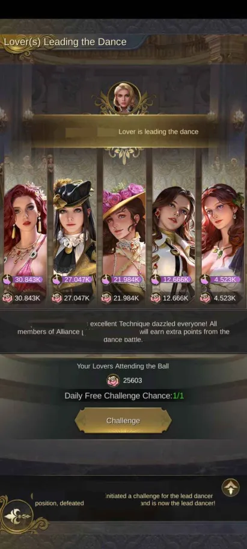
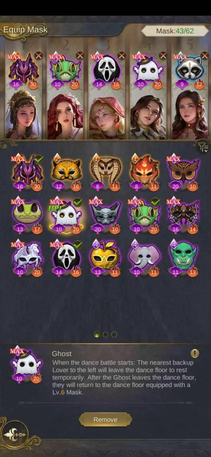

## **__Masquerade Ball__** 🕺💃
## **BASIC INFO**
(see pictures for the numbers)
1.    At the beginning, 5 of your lovers with the highest charm are chosen to attend dance battles by default. Anytime during the event you can choose different ones (but there´s no reason for that) or change their positions, for example switch up two lovers (there´s no reason for this either, it won´t affect the outcome of a dance battle). Only lovers who are “wearing” a mask will attend the dance battle. Above your lovers are numbers – these tell you in which order your lovers will “dance” in a dance battle. (The left one goes first, the right one last.)
2.    Every two completed dance battles you get a chance to choose a new mask or upgrade a mask you already own.
3.    __Every 30 minutes you get 2 stamina__. It costs 1 stamina to attend a dance battle. Max stamina you can get is 15.
4.    “__Dance Practice__” is useful for trying out your mask combos. You copy someone´s IUD, insert it into the text box and you can start Dance Battle with them. **BUT** it doesn´t cost any stamina and you won´t get any points. It´s purely for you to see how your masks work together. It´s a nice way to try different combos without losing any stamina. 
5.    “__Peak Records__” lists the “best” dance battle here and you can view them. Good to see what the top players are using and how these masks work in action. Note: some masks may be "this good" only from a certain mask level.
6.    There is a list of your past dance battles. You can see which ones you won or lost.
7.    There is listed current lead dancer (more info below)

### __**HOW TO BECOME LEAD DANCER?**__
On the main events page, there's a banner with the current lead dancer on the top (see number 7 in "basic info").  Click on the banner and you´ll be taken to lead dancer page. There´s a button “challenge”, after you click on the button, your 5 lovers will challenge 5 lovers of the current lead dancer. 
When you are not strong enough, you will not become lead dancer. But you will have weakened the position for someone else.
When you are strong enough, you will get a 10 minute protection, in that time nobody else can challenge you for the position.

### __**HOW TO BECOME LEAD DANCER?**__
On the main events page, there's a banner with the current lead dancer on the top (see number 7 in "basic info").  Click on the banner and you´ll be taken to lead dancer page. There´s a button “challenge”, after you click on the button, your 5 lovers will challenge 5 lovers of the current lead dancer. 
When you are not strong enough, you will not become lead dancer. But you will have weakened the position for someone else.
When you are strong enough, you will get a 10 minute protection, in that time nobody else can challenge you for the position.

## __**In short**__
° Use lovers with the highest charm.
° When you get a chance to choose or upgrade a mask, choose to upgrade the masks you are already using, unless you can get a even better mask.
° Try your masks during "Dance Practice" to see if you can beat your opponents. 
° If you use your stamina when you or your alliance member is lead dancer, you´ll gain extra points every dance battle. 
° Try to coordinate with your alliance members in order for one of you to become lead dancer. *Do not challenge your alliance members!* 
It does not matter who the lead dancer is, the whole alliance gets the same bonus (including the lead dancer).

> With this mask set-up, you will be unbeatable, it's the best combo there is