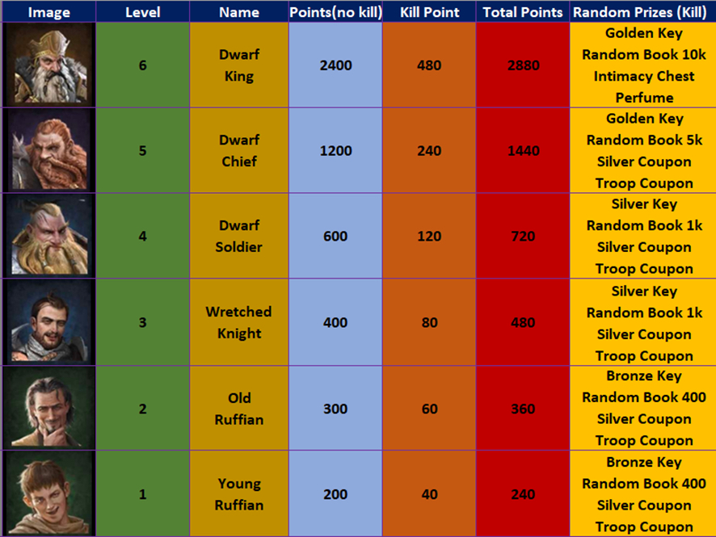

# 🏰 **Nibelungstreasure: Limited-time dungeon event**

The **Nibelungstreasure** event takes place on a map composed of tiles that hide monsters with varying **hit points (HP)**. The strength of the monsters is based on the **power of your server**, and as your server grows, the monsters become stronger (especially compared to other servers).

### 🔍 **Exploring the map**:
- **Undiscovered tiles** (dark): Hide unrevealed monsters.
- **Tilles with ongoing battles** (red): Suggest that someone is attacking an enemy that you might be able to **shoot**.
- **Explored tiles** (gray): Contain slain monsters or opened treasures.

### ⚔️ **Attacking Monsters**:
Tap the **monster icon** to enter the attack interface and select **knights** to fight. Each knight can be used **once**, unless you use a **challenge badge** to bring them back to life (each resurrection costs **additional challenge badges**).

- The **damage** dealt depends on the **power of your knights**.

- **Finishing blow**: Players who deal the finishing blow receive **rewards** and have a chance to find **keys** to open chests (golden chests are worth the most points).

**Tip**: You can use the **Shooting Method** to land the last shot on someone else. This can increase your chances of finding keys if you plan your attack well. Use knights of **different power** for more flexibility.

### 👑 **Working with your alliance**:
If you are aiming for the **title**, coordinate with your **alliance** to whittle down the health of the **dwarf kings** until they can be killed by a single knight. This increases your points and your chances of getting more keys.

### 🗝️ **Keys and Chests**:
Different keys open different chests, and each chest gives you **event points**. The **golden chest** provides the most points.

### 🧮 **Strategy**:
- **Calculate** the power of your knights to determine how many knights you’ll need to kill a monster (1, 2, or more).
- **Save Challenge Badges** or Keys if you want to earn the **title** in the future.

### **Reminder**:
Don’t forget to **save Challenge Badges** if you’re going to earn the title!
