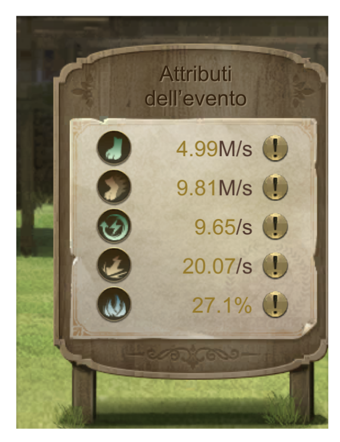
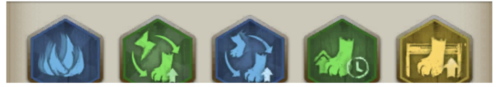
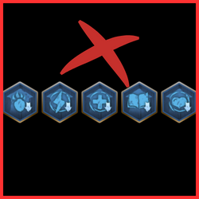
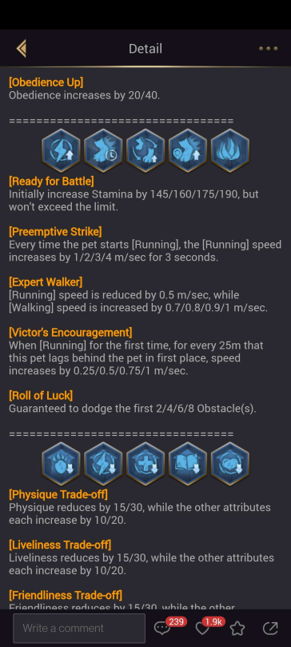
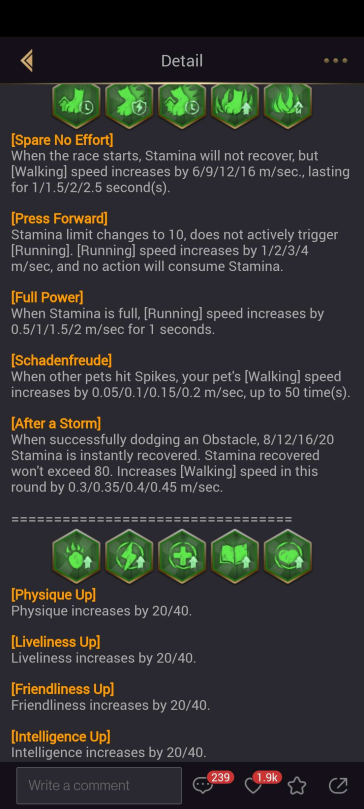

# 🏇 **Pet Race: Compete with your pet**

Race your pet against **five other players’ pets** on an obstacle course! There are **four skill groups** to mix and match (**Blue, Yellow, Green, and Purple skills**). Additionally, the race features different **weather conditions** that affect the course.

### 🏃 **Event Abilities and Attributes**:
Your pet’s abilities are converted into **Event Attributes** that influence its performance during the race:
- **Obedience** → Walking Speed
- **Vivacity** → Endurance Recovery (For Walking)
- **Physical** → Running Speed
- **Friendliness** → Endurance Consumption (For Running)
- **Intelligence** → Obstacle Evasion

Each skill (blue, green, yellow) affects one of these attributes, while **purple skills** affect the path/map. Current event abilities can be found on the **pet's main page**, listed next to the pet.

### 🎯 **Skill Selection Tips**:
- If a skill gives you more advantages than disadvantages, **use it**.
- Don't use a skill that reduces an attribute by **10** if that attribute is already low.
- **Focus on walking and running speed** for optimal performance!

### ⚙️ **Skill Types**:
There are four different skill types:

- **15 Green Skills**
- **10 Blue Skills**
- **5 Yellow Skills**
- **5 Purple Skills**

**Tip**: Skills can be accessed by tapping the **Skill Study** button on the pet page. After every third race, you can choose a new skill or upgrade one for free. You can also refresh your skill choices by purchasing **Trainer Guides** from **Value Packs**.

### 🐾 **Pet Selection**:
The pet with the **highest attribute** is automatically selected, but any pet can participate. Depending on your pet’s abilities, skills can help compensate for weaknesses such as **low intelligence or obedience**.

### 🛠️ **Skill Combination**:
It’s important to **read each skill description carefully**. There are many combinations, so expect some trial and error. Check **peak records** to see what combinations have worked for others and try to replicate them.

### 🏅 **Ranking Points**:
Earn ranking points based on your pet's position at the end of the race:

- **1st place**: 100 points
- **2nd place**: 70 points
- **3rd place**: 50 points
- **4th place**: 30 points
- **5th place**: 20 points

### 🏆 **Top Record**:
If your pet finishes a race in less than **50 seconds**, you can add it to the **top record**. You don't have to submit your record, but you can see which skill combinations are most commonly used by other players.

**Tip**: Before each race, check your opponents' skills to learn from their combinations. Take a screenshot to see which skills were used by the winner!

### 🔱 **Recommended Skill Combinations**:
Here's a **commonly used combination** that increases your chances of winning:

- **[Roll of Luck]**: Guaranteed to dodge the first 2/4/6/8 obstacles.
- **[Eye for an Eye]**: Walking speed increases by 0.6/0.9/1.2/1.5 m/s, but stamina recovery speed decreases by 10%/20%/30%/40%.
- **[Power of Walking]**: During the first race, for every 25m this animal is behind the first-place animal, speed increases by 0.25/0.5/0.75/1 m/s.
- **[Spare No Effort]**: When the race starts, stamina does not recover, but walking speed increases by 6/9/12/16 m/s for 1/1.5/2/2.5 seconds.
- **[Power of Walking]**: For every 40/35/30/25 meters traveled, walking speed increases by 0.5 m/s. Acceleration resets once the animal starts running.

### 🚫 **Skills to Avoid**:
Some skills can hurt your pet's performance (blue arrow down). Keep an eye out for skills that significantly reduce important attributes like speed or stamina!

**Every skill explained**

